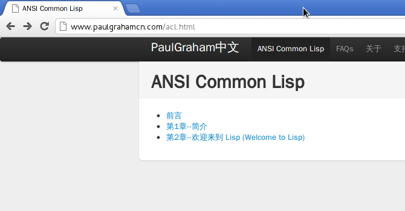
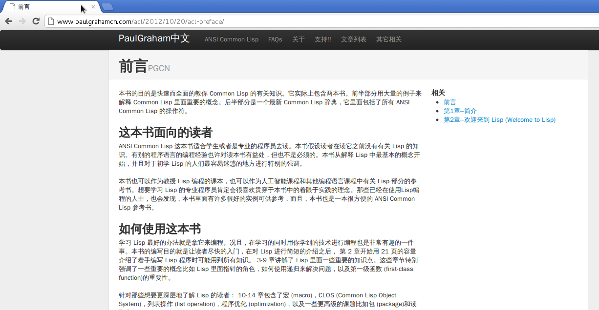
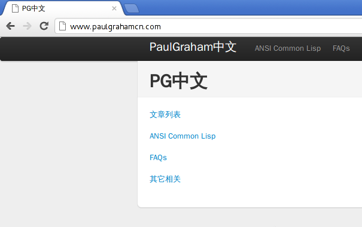
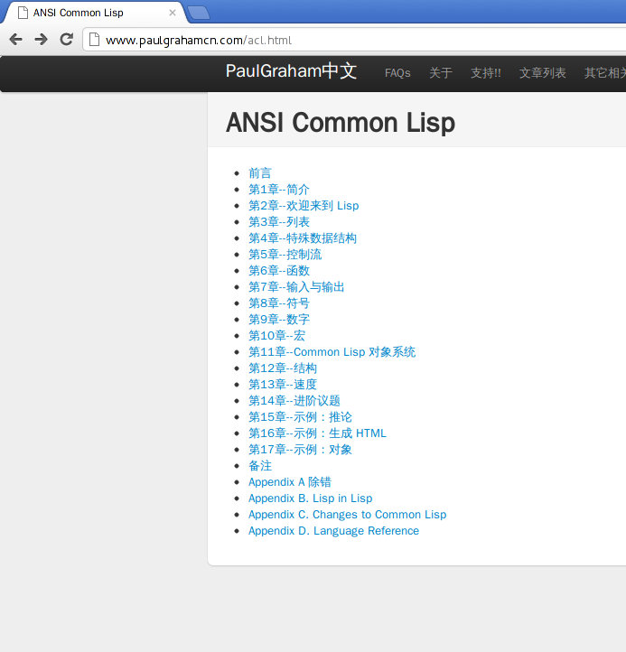

paulgrahamcn.com 恶意转载 ACL 翻译项目事件记录
=======================================================

以下内容复制自豆邮，经由两名当事人同意公开，通信两方分别是 `中华 <http://www.douban.com/people/ada_yaha/>`_ 和 `huangz <http://www.douban.com/people/i_m_huangz/>`_ 。

其中 PG 代指 Paul Graham ， ACL 翻译项目代指 \ `acl-translation <https://github.com/organizations/acl-translation>`_ ， PGCN 代指\ `www.paulgrahamcn.com <http://www.paulgrahamcn.com>`_ 。

恶意转载证据截图： `http://www.douban.com/photos/album/79814158/ <http://www.douban.com/photos/album/79814158/>`_ 

我（huangz）在一些地方添加了截图，并用以下格式添加了注释。

| \| 注释
| \|
| \| 注释内容

1) 中华 2012-10-20 20:19
----------------------------

你好，我准备把acl的中文翻译，在这个站里做一个专门的目录放着。 
　　 
**然后期待有心人，能够继续翻译。**
　　 
也希望能够扩大一下影响力，影响更多的人做这个工作。 

2) huangz 2012-10-20 20:59
-------------------------------------

这个主意很好。 
 
不过我认为，只放一个转到 http://ansi-common-lisp.readthedocs.org/ 的链接，而不是直接拷贝整个文档比较好。 
　　 
这样一来保证了文档自动更新，二来读者有问题可以直接在原文档里讨论，而不必分散到其他地方。 
　　 
另外分流会减少原文档的点击量，这可能会打击现有译者的积极性， ReadTheDocs 的目前的访问状况良好，应该没有分流的必要。 
　　 
当然，以上只是我的个人建议，你可以按你喜欢的方式来做。 
　　 
有其他问题或者需要帮助的话，尽管联系我。嗯。 

3) 中华 2012-10-20 22:26
--------------------------------------

| 好阿。 
| 那我就在每篇文章的开头加一个链接过去吧。 
　　 
**我想提高一下paulgrahamcn.com的排名。** 
　　 
而且等我把sicp读完之后，我想再重新读一遍acl。以前读的太马虎了。 
　　 
| **下次读的时候，就可以顺便做点翻译工作了。**
| 可能做得不是很好，也不怎么和规范，个人比较喜欢随性的做翻译。所以可能还得在这里加一些静态文件。 
　　 
顺便帮我转告一下你的那位台湾朋友，我很支持他。 
　　 
当初我在lisp组里求这本书的时候，这本书的翻译还遥遥无期呢。 
　　 
现在都快结束了。 
　　 
我也赶个末班车，帮一把。 

4) huangz 2012-10-20 23:09
---------------------------------------

好的，明白了，我会转告他的。 
　　 
期待你的贡献。 
　　 

5) 中华 2012-10-21 00:30
----------------------------------------

如果你有认识的朋友也对PG感兴趣，希望也能多帮忙paulgrahamcn.com这个站。 
　　 
**我希望把paulgraham.com上的所有东西都汉化了。**
　　 
**不只是acl。**
　　 
目前在几个朋友的帮助下，已经翻译了一部分paulgraham.com上的文章了。 

| \| 注释
| \|
| \| 这时 @中华 已经往自己的网站上搬运了几章 ACL 的翻译了
| \| 而且在这些转载的文章中，对 ACL 翻译项目只字未提：
| \| 

6) huangz 2012-10-21 08:57
-----------------------------------------

昨晚和 ACL 中文翻译的主要译者 juan 谈过了，老实说，我们都不认同你要将 ACL 分流到你自己网站的做法。 
　　 
如果你对现有的 ACL 翻译有什么意见和建议，可以随时到 github 上开 issue 提出来，也可以直接贡献代码，我们会很愉快地接受的。 
　　 
不过，如果你一定要重新造一个 ACL 翻译，并且放在你自己的网站上的话，那么我请求你不要使用现有 ACL 翻译的任何代码。 
　　 
原因很简单：从 ACL 中文版开始翻译，到今天为止，据我所知，你没有为这个项目提供哪怕一条意见和建议，也没有为这个项目贡献任何代码，更不是六个译者中的任何一个。所以，我不认为你有任何资格去“借用”现有译者的成果。 
　　 
在没有做出任何贡献的情况下，单单是从自身网站的流量来考虑，对 ACL 翻译项目进行分流和修改，这种做法太让人面红了，对这个项目，以及所有这个项目的贡献者来说，都是一种伤害。 
　　 
以上就是我们对于此事的态度，希望你能慎重考虑这件事。还有任何疑问的话，可以继续联系我。 

7) 中华 2012-10-21 13:10
------------------------------------------

| 不好意思，如果我的做法有伤害到你们，我表示道歉。 
| 但是我想澄清一下，或许你们误解我了。 
 
| 1， 
| **我并不是想纯粹的提高这个站的流量。** 
| 
| 这个站不是一个商业网站，只是一个兴趣站点。 
　　 
| 2， 
| 我当时做这个站的目的，是为了翻译pg的文章。 
| 所有他相关的文章，不只是h&p里的一小部分。 
　　 
| acl也是pg的一本书，在他的个人网站上也有介绍。 
| **为了做的更全面一些，本来也准备翻译这本书的。** 
　　 
| 但是既然有同学已经\ **做了一部分**\ 了，我也不希望重新造轮子了。 
| **希望能站在巨人的肩膀上**\ ，继续走下去，能把这个兴趣站做的更好，也希望他的文章和他的书，能影响更多的人。
　　 
| 3， 
| 好东西应该分享给大家，就像GNU那样；而不是BG那样，封闭。 
| PG对我的影响很大，而且我也很懊恼，为什么这么晚才接触到他。 
| 所以我希望后来的人，不要再像我一样，因为太晚接触到，而懊恼。 
| 所以我要做他的站的中文版，让更多的人了解。 
|  
| 我也给PG发了一封邮件，把我的想法告诉了他。 
| 他回邮件，也很感谢我做的事情。 
　　 
| 4， 
| 做之前，我在网上搜了一下我的这个想法。 
| 确实找到了一个类似的站。但是这个站已经太久不更新了。 
| 等我的站上线后，上面那个站的作者找到我，他想给我提供帮助，把他的站里的文章给我用。只是后来太忙，就没继续作下去。 
|　 　 
| 现在我又有时间了，又继续作这个站了。 
　　 
| 5， 
| 如果你和你的朋友还是不能接受的话，那我就在github上fork一份，然后在这个fork上继续做。 
　　 
| 你们觉得呢？ 

| \| 注释
| \| 
| \| 这时 @中华 已经将 ACL 翻译全部转载到自己的网站上，并在主页上添加了『自己』的 ACL 链接。
| \| 网站上还是对 ACL 翻译项目只字未提，这些文章看上去就像是 @中华 自己『翻译』的一样。

8) huangz 2012-10-21 15:23
---------------------------------------

我对你和 PG 或者你和你朋友之间感人至深的故事没有兴趣，我只反驳你的其中两点就够了。 
　　 
首先，既然你那么热切地想为 ACL 的翻译做贡献，为什么在 ACL 翻译进行的半年多快一年的时间里，你从来就没给文档项目贡献过一行代码？提交过一个 issue ？抓过一个 bug ？ 
　　 
现在可好， ACL 的翻译已经接近尾声了，你一句『站在巨人的肩膀上』就要将别人的整个翻译项目拿走，如意算盘未免打得太好了。你觉得这个项目的贡献者会同意？你这样不是直接伤害他们？笑话！ 
　　 
另外，不要跟我扯什么封闭。文档放在 ReadTheDocs 平台上，任何人都可以阅览。翻译项目是放在 github 里的，不是私有项目，是公开的组织项目，任何人都可以来贡献，都可以来开 issue ，我们没有拒绝过任何一个人的 pull request ，也没有删除过任何一个人的 issue 。 
　　 
我想请问一下，这样的翻译项目，哪里封闭了？ 
　　 
说实在的，我觉得你的意图非常明显，就是想将翻译好的 ACL 转载到你自己的网站上，就是想不劳而获，将 ACL 翻译项目各位贡献者半年多来的辛苦成果变成你网站内容的一部分，我说得对不对？ 
 
当然，对于这种行为，我们除了谴责以外，是做不了什么来阻止你的，我想你也清楚这一点。不过，如果你还是执意要将 ACL 翻译项目的内容复制到你自己的网站，那么为了维护这个项目和项目贡献者的利益，我保留使用以下手段的权利： 
　　 
1. 通知 ACL 翻译项目的所有贡献者，他们的翻译成果遭到了侵犯 
2. 在豆瓣、微博、TWITTER、CN Lisp 群组等一切我能想到的地方，公开这封信件的内容，以及你的所作所为 
3. 在包括 http://ansi-common-lisp.readthedocs.org/ 、我已有的所有文档、以及将来的文档里，添加上关于 ACL 翻译内容被恶意转载的说明，并附上 paulgrahamcn.com 、你的豆瓣地址、 QQ 和 EMAIL 等信息。 
　　 
对于你翻译 PG 的文章，我表示欢迎和支持，有人愿意汉化 PG 的文章，是一件大好事。 
　　 
不过，如果你真的想翻译 ACL ，而且又不想、或者不屑于和 ACL 翻译项目扯上关系， 那么我建议你最好自己完完整整的，从头开始翻译一份属于你自己的 ACL ，不要随随便便就『站在巨人的肩膀上』。 

9) 中华 2012-10-21 17:43
------------------------------------------

我觉得，你的语气可以客气点。 
 
| 我客客气气的跟你讲这件事情，而不是偷偷拿走，说明了我对你们的尊重。 
| 而你别在这拿着尊重，当饭吃。 
 
| 你也别在这一口一个谴责，一口一个“公布散布”，还什么发布各种公开信息。 
| ？？威胁我么？ 
 
| 而且我也是在和你商量这件事情，没有说一定要怎么怎么样。 
| 你也别在这得瑟个没完。 

::
　　 
    我对你和 PG 或者你和你朋友之间感人至深的故事没有兴趣，我只反驳你的其中两点就够了。 
    　　 
| 你觉得我是想拿故事感动你？ 
| 晕倒，自作多情。 
| 我是让你知道，\ **我是为了兴趣而做这件事情，而不是什么你说的，单单为了提高网站流量。**

::

    首先，既然你那么热切地想为 ACL 的翻译做贡献，为什么在 ACL 翻译进行的半年多快一年的时间里，你从来就没给文档项目贡献过一行代码？提交过一个 issue ？抓过一个 bug ？ 
     
| 这是我个人问题了。\ **虽然我没有为ACL项目做过什么贡献**\ ，但是自从我知道这个项目之后，就尽我所能为这个项目做宣传。包括在自己朋友圈里，包括在豆瓣小组，你可以在lisp小组里找到这个帖子。 
 
| 现在我有时间了，也准备为这个项目做贡献啊。包括翻译一些未翻译的文章，仔细挑一些BUG。大家都是在做一件事情，为了让这个项目变得更好。 

::

    现在可好， ACL 的翻译已经接近尾声了，你一句『站在巨人的肩膀上』就要将别人的整个翻译项目拿走，如意算盘未免打得太好了。
    你觉得这个项目的贡献者会同意？你这样不是直接伤害他们？笑话！ 
     
| 我窃取你们的劳动成果？ 
| 好，如果你们禁止转载，只允许以链接的形式导向，应该在项目文档里说明这种情况。 
| 因为你们没有说明，所以我在这里跟你商量这件事情。 
| 现在你们的意思已经很明白了，我希望你们能在项目文档里加一条。 
| 这样就不会有第二个人做像我这件事情了。 

::

    另外，不要跟我扯什么封闭。
    文档放在 ReadTheDocs 平台上，任何人都可以阅览。
    翻译项目是放在 github 里的，不是私有项目，是公开的组织项目，任何人都可以来贡献，都可以来开 issue ，我们没有拒绝过任何一个人的 pull request ，也没有删除过任何一个人的 issue 。 
    我想请问一下，这样的翻译项目，哪里封闭了？ 
     
| **我说的封闭不是别人看不到项目内容，而是不能转载加链接。**
| 如果有这样的，禁止转载加链接的协议，你们应该用这样的协议。 
| 如果没有这样的，或许可以自己发明一个。 
| 即使不用这样的协议，也可以在文档里声明一条。 

::

    说实在的，我觉得你的意图非常明显，就是想将翻译好的 ACL 转载到你自己的网站上，就是想不劳而获，将 ACL 翻译项目各位贡献者半年多来的辛苦成果变成你网站内容的一部分，我说得对不对？ 
     
| 你说的不对，我从没想过不老而获，我也获得不了什么。 
| 如果我把文章转载到我的站上， 
| 一来我可以在整理的过程中发现一些问题，修改并给你们提BUG。 
| 二来，当别人看到我的转载，会看到你们的原链接，也会更多的关注，文章最开始的地方，会感激原作者或者团队。我起到的作用是宣传。至少我是会关注原著，而不是转载的人。 
| 三来，我会更好的学习Lisp，这也许是我唯一能获得的东西。 
| 四来，把一些未完成的章节，自己做一些努力，然后提给你们。 
 
| 不过现在看来我也没必要这么做了。 
| **我会把ACL从站上撤下来的。**\ 这个你可以放心。 

::

    当然，对于这种行为，我们除了谴责以外，是做不了什么来阻止你的，我想你也清楚这一点。不过，如果你还是执意要将 ACL 翻译项目的内容复制到你自己的网站，那么为了维护这个项目和项目贡献者的利益，我保留使用以下手段的权利： 
    
    1. 通知 ACL 翻译项目的所有贡献者，他们的翻译成果遭到了侵犯 
    2. 在豆瓣、微博、TWITTER、CN Lisp 群组等一切我能想到的地方，公开这封信件的内容，以及你的所作所为 
    3. 在包括 http://ansi-common-lisp.readthedocs.org/ 、我已有的所有文档、以及将来的文档里，添加上关于 ACL 翻译内容被恶意转载的说明，并附上 paulgrahamcn.com 、你的豆瓣地址、 QQ 和 EMAIL 等信息。 
     
| 可笑，威胁我么？！ 
| 既然你们在GITHUB上建立项目，那就是默认接受了它的协议。 
| 如果你们的协议里，有一条是禁止转载，请告诉我。我也长见识了。 
| 如果没有这样的协议内容，而我在这里跟你通过豆邮来商量这件事情，还没什么最终结果呢，就这在XXXX公布内容，还XXX散布QQ，EMAIL。 
| 我无语了。 
 
| **既然你这么想公布豆邮内容，我是同意的。**
| **如果你也同意，那我们就公布一下。**

::

    对于你翻译 PG 的文章，我表示欢迎和支持，有人愿意汉化 PG 的文章，是一件大好事。 
     
只有这句话，没有什么敌意。 

::

    不过，如果你真的想翻译 ACL ，而且又不想、或者不屑于和 ACL 翻译项目扯上关系， 
    那么我建议你最好自己完完整整的，从头开始翻译一份属于你自己的 ACL ，不要随随便便就『站在巨人的肩膀上』。 
     
| 我没有说，不想不屑和现有的ACL项目扯上关系，我是说，我做事情比较随性一些，对于你们的规范可能不怎么遵守。 
| 而且我也打算在学习一段时间之后，给现有的ACL项目做贡献。 
| 我不是跟你说了么，我准备Fork一份。 
 
**我不想重新翻译一份“属于我自己的ACL”。我也没那个时间。**
 
\============================================================= 

| 说了这么多，现在情形已经很明了了。 
| 你的态度：不希望转载加链接，要不然，XXXX。 
| 我的态度：还是那句话，我还是很尊重你们做的工作。 
　　 
**结论：撤下paulgrahamcn.com上的acl。**
 
下次讲话，可以客气一点。 
 
| 到此为止吧，不要让内耗消耗你的精力，继续翻译ACL吧，让它的中文版尽早面世。 
| 希望下一个想看ACL的人，可以看到中文版，不要像我一样，龟速的把英文版啃一遍。 
　　 
如果有机会和时间，我会继续关注这个项目的。 
　　 　　 

10) huangz 2012-10-21 20:53
-----------------------------------

| 是的，你的尊敬我们已经感受到了，请遵守你所说的，撤掉你网站上的 ACL 副本吧。
| （这个以及其他相关的都请移除掉吧？ http://www.paulgrahamcn.com/acl.html ） 
　　 
想让这个项目变得更好的话， github 永远为你开放着： https://github.com/acl-translation/acl-chinese 
　　 
想帮忙宣传 ACL 的话，请添加超链接到 http://ansi-common-lisp.readthedocs.org/ ，对此，我们非常欢迎。 
　　 
最后，你的回复中非常强调“协议”，那我就告诉你，在今天早晨 ， ACL 的主要译者就更新了项目的 README 文件，特别增加了一条“禁止全文转载！”的规则，至于这条规则怎么来的，我想大家都明白了： https://github.com/acl-translation/acl-chinese/commit/c9838c08ea7a216c1ae72333e9e0097488c0e225 
　　 
那么，为什么之前不说明“禁止全文转载”？理由很简单，辛苦忙活了一年的翻译项目，在某天睡醒觉之后就被别人全部拷贝走了，这种事谁能预想到阿，简直是天荒夜谈阿！换作你， PGCN 翻译了一年半载之后，忽然某个网站将你翻译的文章全部转走了，你能相信吗？你该用什么表情去面对？ 
　　 
所以，既然大家都说清楚了，那劳烦你清空网站上的 ACL 副本吧，我们对此也会非常感谢的。 
　　 
人和人之间能够互相理解，实在是太好了。 
　　 

11) 中华 2012-10-22 09:38
-----------------------------------

::

    是的，你的尊敬我们已经感受到了，请遵守你所说的，撤掉你网站上的 ACL 副本吧。（这个以及其他相关的都请移除掉吧？ http://www.paulgrahamcn.com/acl.html ） 
     
任何人做一些让世界变得美好一点的事情，我都会“尊重”的，而不是“尊敬”。请注意用词。 
 
已经拿掉，你可以监督。 

::

    想让这个项目变得更好的话， github 永远为你开放着： https://github.com/acl-translation/acl-chinese 
     
我觉得经过了这么几封豆邮，我会精神上继续支持你们的。 
 
::

    想帮忙宣传 ACL 的话，请添加超链接到 http://ansi-common-lisp.readthedocs.org/ ，对此，我们非常欢迎。 
 
怎么做是我的事情，在现在的心情下，我可以考虑一下你的建议。 

::

    最后，你的回复中非常强调“协议”，那我就告诉你，在今天早晨 ， ACL 的主要译者就更新了项目的 README 文件，特别增加了一条“禁止全文转载！”的规则，至于这条规则怎么来的，我想大家都明白了： https://github.com/acl-translation/acl-chinese/commit/c9838c08ea7a216c1ae72333e9e0097488c0e225 
     
| 非常好，不要因为自己的协议没写清楚，这时别人去跟你商量，而去责怪别人。 
| 我觉得你们可以再加一条，同时禁止fork然后自己搞，然后分流，而不是给现有的ACL做贡献。 
 
| 因为我还这么提议过一次，而你也严词拒绝了。 
| 所以如果你不加这条协议，而我又特别较真的去这么做了，不知道你会如何反应。 

::

    那么，为什么之前不说明“禁止全文转载”？理由很简单，辛苦忙活了一年的翻译项目，在某天睡醒觉之后就被别人全部拷贝走了，这种事谁能预想到阿，简直是天荒夜谈阿！换作你， PGCN 翻译了一年半载之后，忽然某个网站将你翻译的文章全部转走了，你能相信吗？你该用什么表情去面对？ 
    　　 
**只要别人使用的是转载加链接的方式，我就非常欢迎。**

::

    所以，既然大家都说清楚了，那劳烦你清空网站上的 ACL 副本吧，我们对此也会非常感谢的。 
 
**目前我已经拿掉了链接，副本这块，目前不是很方便；不过你放心，我既然说了，那就不会继续使用你们的ACL。**

::

    人和人之间能够互相理解，实在是太好了。 
 
我一直在理解你们。 
 
\=================================================================\

| 到这里，也许你觉得事情已经完了，而我觉得还有几件事情没有做。 
| **1，你没有回答我，是否同意公开豆邮内容。希望能给予回复。我已经明确给你回复了。**
| 2，我的提议，希望你们考虑，就是你们的文档里再加一条。 
| 3，我最讨厌别人使用激将法，\ **我考虑了一下，准备采纳你们的建议，做一份属于自己的ACL，按照我的方式；**\ 也请你监督，我是否使用了你们的一行代码。 
| 4，不管是你或者我，\ **请在双方都同意的情况下，尽快公开豆邮内容,**\ 然后把链接给对方，让对方确认内容没有被篡改。
　　 
Over，祝你们的项目越来越好。 

12) huangz 2012-10-22 10:01
-------------------------------

等你遵守诺言，将网站上的 ACL 翻译删除完之后，我再回答你的 1 2 3 4 好了。 
　　 
http://www.paulgrahamcn.com/tags 
　　 
http://www.paulgrahamcn.com/acl/2012/10/20/acl-preface/ 

13) 中华 2012-10-22 13:52
-------------------------------

已完成，请监督。 　　 　　 

| \| 注释
| \| 
| \| 在 @中华 主动承诺删除网站上的副本之后，并表示『事件告一段落』的时候，实际上他只是将主页上的 ACL 链接移走了，并没有删除源文件。
| \| 我当然不会被这种掩耳盗铃的小把戏骗过，于是在 10) 给出了 `http://www.paulgrahamcn.com/acl.html <http://www.paulgrahamcn.com/acl.html>`_ 地址，要求他遵守诺言。
| \| 之后， @中华 又故计重施，将上面我给出连接的 ACL 子文件夹的目录删除了，但是各章的源文件依然在，并表示『不太方便』。
| \| 我收到邮件后，从 jekyll 的 tag 目录确认到，他仍然没有删除 ACL 各章的翻译文件。
| \| 于是我在 12) 将 tag 页面以及其中一个子页面的地址发送给他，催促他遵守承诺。
| \|
| \| @中华 见自己无法隐藏 ACL 翻译的文件，恼羞成怒，只好将所有 ACL 页面的内容改成『SHIT』。
| \| 截止目前，这个 SHIT 页面现在还能看到： `http://www.paulgrahamcn.com/acl/2012/10/20/acl-preface/ <http://www.paulgrahamcn.com/acl/2012/10/20/acl-preface/>`_ 。

.. image:: image/shit-lite.png

14) huangz 2012-10-22 17:10
---------------------------------

感谢你遵守承诺，我很赞赏。 
　　 
现在到我遵守承诺，来回答你的问题了。 
　　 
你说的第 2 点，我会向项目的相关人员反映的，感谢你的建议。不过，从程序员的角度来看，这种规则是没有办法穷尽的。所以，如果还有其他人来伤害 ACL 翻译项目，那我们也只能尽可能地要求对方不要那么做而已，就像这次一样。 
　　 
至于第 3 点，如果你决定重新翻译一份 ACL ，有空的话，我倒是很愿意去帮忙抓 bug 和贡献 issue 的，到时把项目地址发给我就行了。当然， PGCN 也是一样。 
　　 
至于你在第 1 点和第 4 点提出的，要公开信件内容的要求，我是完全同意的。 
　　 
信件的内容劳烦你放到一个 github 项目上，整理好之后把项目地址发给我，有什么问题我开 pull request 就行了，这样就不用各自都写一篇文章了。 
　　 
而且我有一些相关的资料，到时可以直接补充上去，用 github 来记录就不会造成信息不对称了，这对那些希望了解这件事的人来说，都有好处。 

15) 中华 2012-10-22 22:48
------------------------------

1，我做这件事情可能比较随性一些。比如我会用MD，而不用RST，即使使用LATEX或者HTML也不会用RST。 
　　 
所以不太欢迎你提BUG和ISSUE给我，但是我坚决支持你质疑的权利。 

| **2，如果你认为我原先想做的事情是伤害到了ACL翻译项目的话，那就更应该把这封信的内容让别人知道了。而且越多人知道越好。**
| 这样一来可以告诉想做我原来想做的事情的人，那样会对此项目造成伤害； 
| 二来即使想通过GITHUB提供的Fork的方式做的话，也会对项目造成伤害。 
| 三来告诉任何想做一些和ACL翻译相关的事情的人，要么给此ACL项目做贡献，要么自己从头翻译一份属于自己的ACL。其他的任何行为都是对ACL项目的伤害。 

　　 
| 3，至于如何公开这封信的内容，你建议放在GITHUB上。这是你认为比较妥当的方式，我支持你这么做。 
| 而我会放在日记里或者放在豆瓣的Lisp小组里，既然在豆瓣发生的事，我觉得发在豆瓣里比较妥当。不管通过什么途径发布，只要保证原样公布，不通过任何方式误导大众，曲解内容就行。 
| 这样让更多的人知道不要做XXX事情，不要对ACL项目造成伤害。 
| 让他们知道，如果警告不起作用，那么你们保留做XXX事情的权利。 

我会按照时间顺序，把每封邮件里的内容贴出来。 
　　 
4，本来还想较个真，既然你们放在GITHUB上的公开项目，而文档里又没有说清楚，我当然可以Fork。不过最后我决定不这么做了，还是那句话，不要让内耗消耗了你们的精力，更多地精力应该放在ACL的翻译上，让他尽快面世。 
而且也告诉看到这些内容的人，也不要做我想较真而去做的事情。 
　　 
以上就这些了，让这件事情了结了吧，然后各忙各的，做一些让世界更美好一点的事情去吧。
